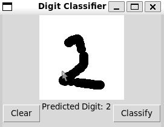
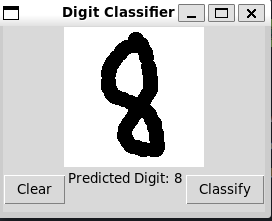

# Result


The model has an accuracy of 0.98

Classify 0


Classify 1


Classify 2



Classify 3


Classify 4


Classify 5


Classify 6


Classify 7


Classify 8



Classify 9


# How to Run

1. Create a virtual environment

```bash
python3 -m venv  myenv
```

2. Activate the virtual environment

```bash
source myenv/bin/activate
```

or create a .vscode/settings.json like i did 3. Install the requirements

```bash
pip install -r requirements.txt
```

4. Run the app

```bash
python3 app.py
```

# How to Run the test.py to know the accuracy of the model

```bash
python3 test.py
```


model.py is the file that contains the model

train.py is the the training of the model, you can feel feel to adjust hyperparameters to get a better accuracy
